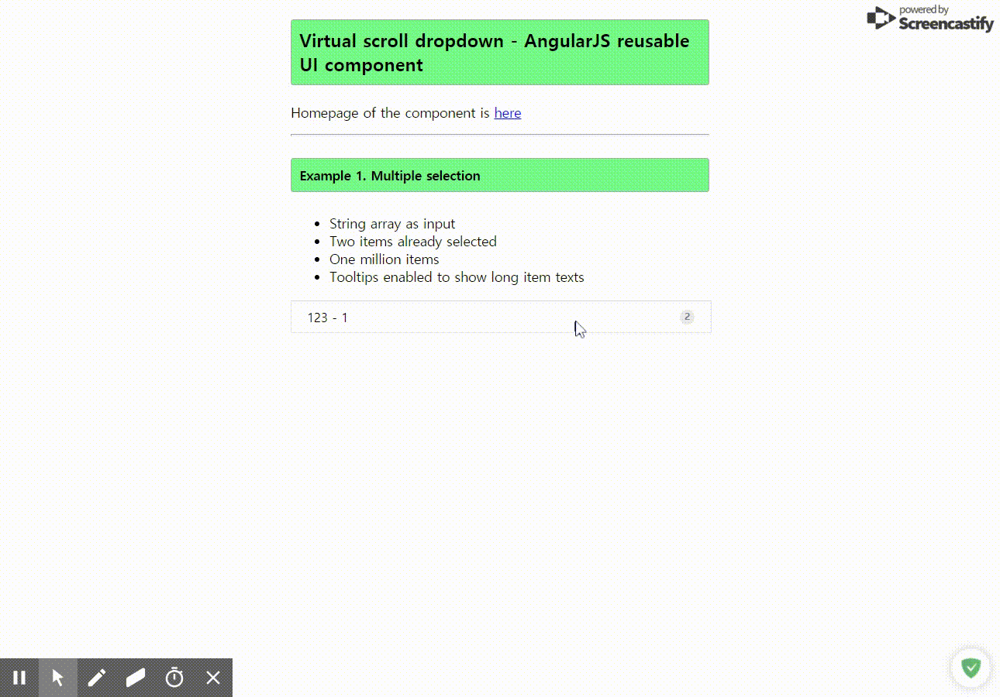

# vsdropdown
- [vs-repeat](https://github.com/kamilkp/angular-vs-repeat)를 이용한 드롭박스
- [kekeh vsdropdown](https://github.com/kekeh/vsdropdown)를 참고
- gulp 실행 시 localhost:8888로 서버 열림(gulpfile.js)

## component bind
- options: '<'    
    - [옵션 오브젝트](src/controller.js)
- items: '<'
    - 아이템 배열
- selected: '=',
    - 선택된 아이템 배열
- onAdd: '&' ($item, $index, $event)
- onClick: '&' ($item, $index, $event)
- onRemove: '&' ($item, $index, $event)
- onBottom: '&' ()
    - 이벤트 함수 바인드
- placeholder: '@'
    - inputbox placeholder

## License
* License: MIT
